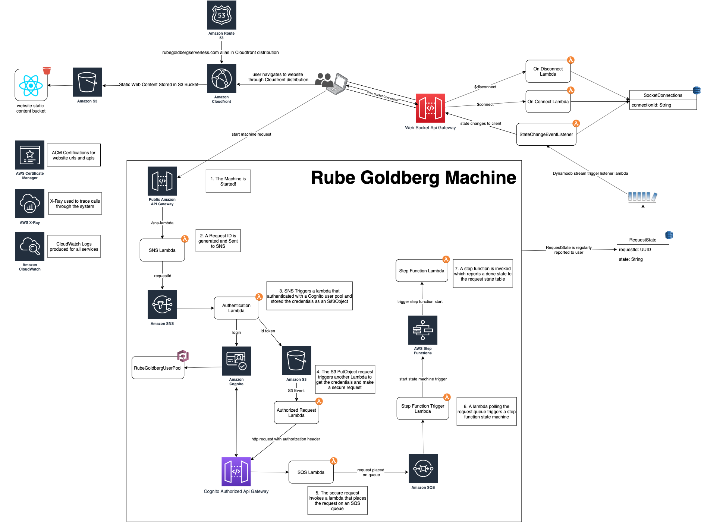

# Serverless Rube Goldberg Machine

This project is a rube goldberg machine showing off all the cool capabilities of serverless tech! The process that executes is a complete waste of time and money! 

I built it to learn a bit more about serverless tech, their performance, and the aws cloud development kit. What ensures is series of aws lambda functions triggered by a number of services including sns, sqs, api gateway, secure api gateways, s3, step functions, and dynamodb streams. 

## Architecture

This project is a combination of a number of serverless functions in an event driven architecture that makes use of public, secure, and web socket Api Gateways, DynamoDB, DynamoDB Streams, SQS, SNS, Step Functions, Cognito, S3, X-Ray, CloudWatch, and Route53. The architecture can be found below.



## Setup
You can stand up this stack yourself if you'd like! Follow the instructions at [AWS CDK Getting Started](https://docs.aws.amazon.com/cdk/latest/guide/getting_started.html) to ensure your machine is setup correctly to use the Amazon Cloud Development Kit(CDK).

If you haven't used the cdk in your aws account yet, you'll need to bootstrap it with the following:

```
$ cdk bootstrap aws://<account_id>/<region>
```

## Deploy
All of the services use the aws cloud development kit except for the web-app

To deploy the backend:
```
$ cd $BASE_DIR/rube-goldberg-machine
$ npm run build
$ cdk deploy
```

The webapp cloudformation template has parameters for the domain related information that can be configured as needed.

To deploy the webapp:
```
cd $BASE_DIR/web-app
sam build
sam deploy
npm run-script build
aws s3 sync build/ s3://rubegoldbergserverless.com --acl public-read
```

Note: You must have appropriate access and secret keys setup on your machine for the AWS account

## Web Socket testing

You can test the web socket connection using wscat given the web socket url that is exported when a deployment occurs

```
wscat -c <url>
```